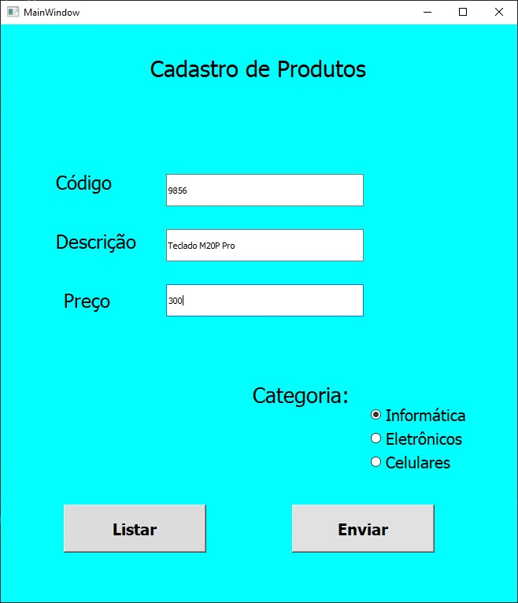
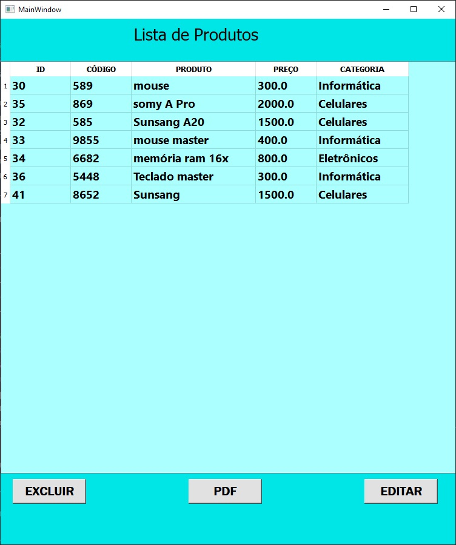
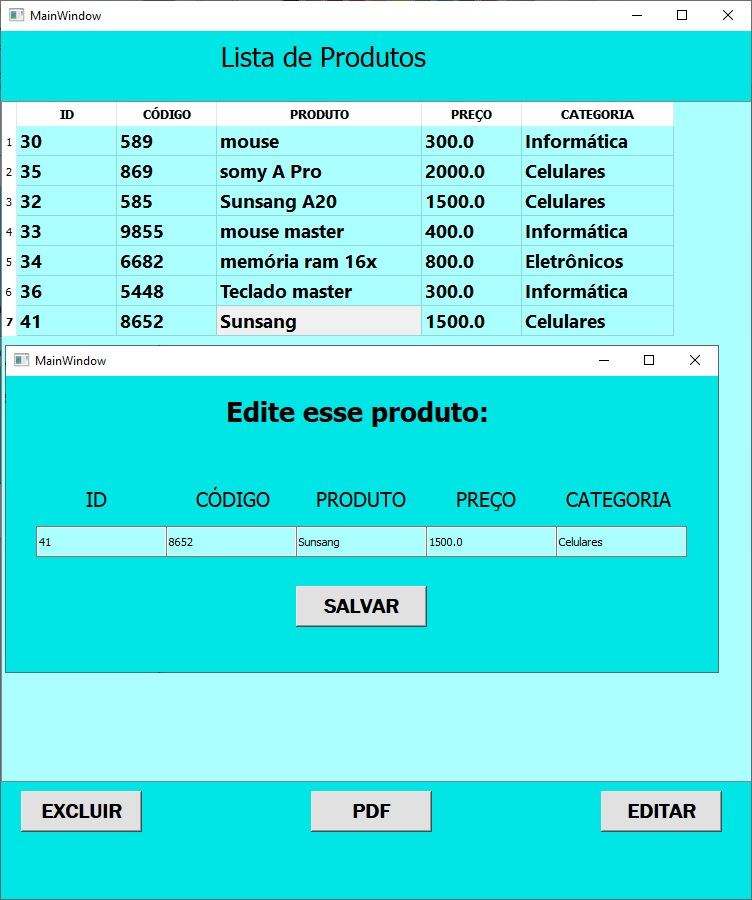

# Listagem de produtos

Sistema que é  utilizado para criar uma lista de produtos que salva tudo juntamente no banco de dados. Nesse caso, foi utilizado o MySQL !! 

Na aba lista de produtos, é possível excluir, gerar um PDF e editar o produto juntamente ao banco de dados !!

